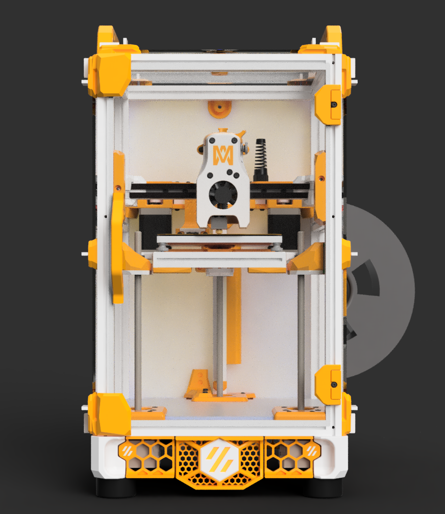
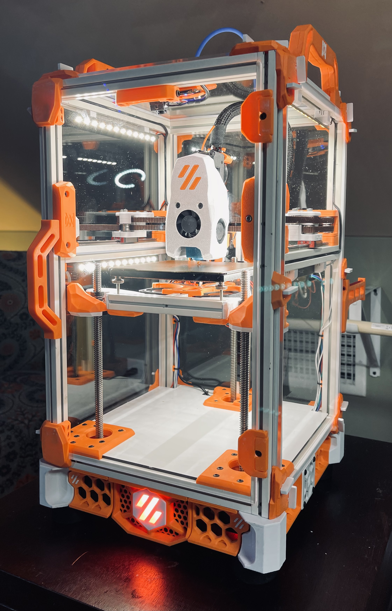

# Crucible 

## Features
* A VORON Trident on a V0 scale
* Overall dimensions (mm): 230x230x360
* Build volume (mm): 120x120x120
* Klicky Probe integration
* Quick release panels
* Under-bed carriage fans 
* Fancy name

## Work in Progress

Please bear in mind that this is a WIP - please be patient as the existing design is improved upon and stay up to date at the [Discord channel](https://discord.gg/UQzPxNhA92).

## Parts Needed for V0.1 Conversion
* (4) 360mm 1515 Extrusions
* (3) IGUS GE5C Spherical Bearings
* (2) NEMA17 Stepper Motor w/ integrated lead screw 200mm T8x8
* (8) F623 Bearings
* (4) 4010 Fans - For Skirt and Bed
* (1) 150mm MGN9C Linear Rail
* MCU capable of handling additional steppers (dual or otherwise)
* 3mm foam strips 
* Acrylic panels 
* Misc. M3 hardware of varying lengths

## Recognition
* Nemgrea#4325 / VORON Design [V0.1](https://vorondesign.com/voron0.1)
* Slayga#8084
* Mike4D#8668
* hartk#1213 [Micron Parts](https://github.com/hartk1213/Micron)
* MCMBen#6371  [Trident Skirt](https://github.com/Fleafa/VoronUsers/tree/V0.1-Trident-skirt/printer_mods/MCMBen/Voron0_Trident_Skirt) 
